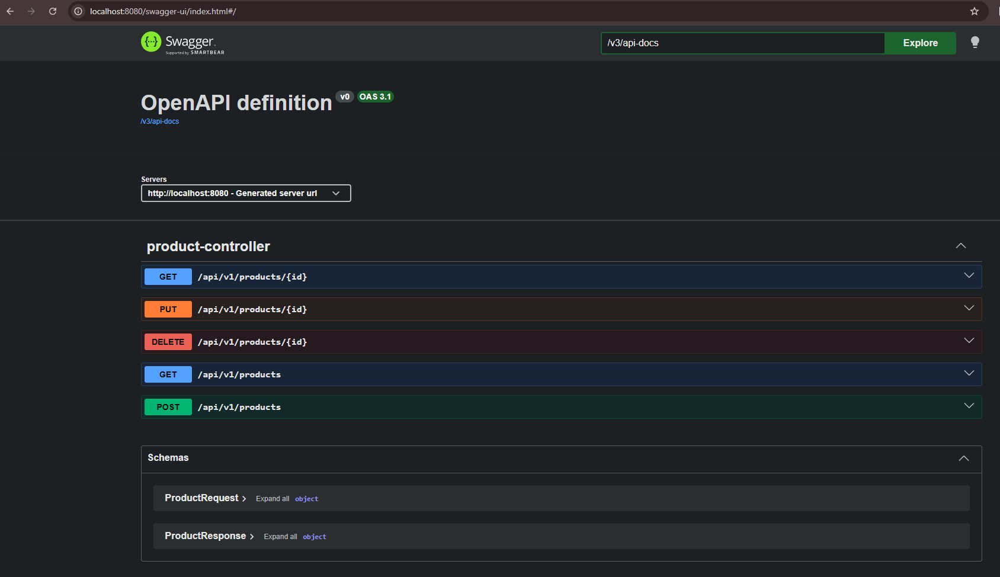
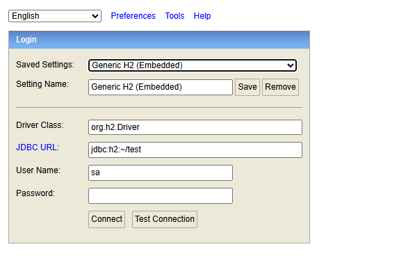
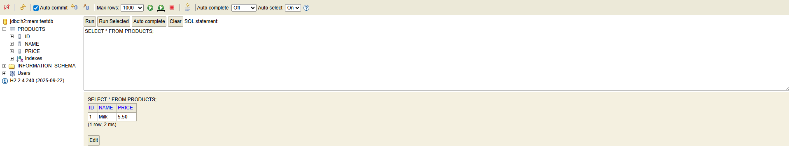

# Task 2 – First REST API (Spring Boot)

Spring Boot REST API project with CRUD operations, Swagger UI, and H2 in-memory database (JPA).

## Base path
`/api/v1/products`

## Endpoints
- POST `/api/v1/products`
- GET `/api/v1/products`
- GET `/api/v1/products/{id}`
- PUT `/api/v1/products/{id}`
- DELETE `/api/v1/products/{id}`

## Swagger UI
`http://localhost:8080/swagger-ui/index.html`



## H2 Console
`http://localhost:8080/h2-console`  
JDBC URL: `jdbc:h2:mem:testdb`  
User: `sa`  
Password: *(empty)*



## Database check

```sql

SELECT * FROM PRODUCTS;

